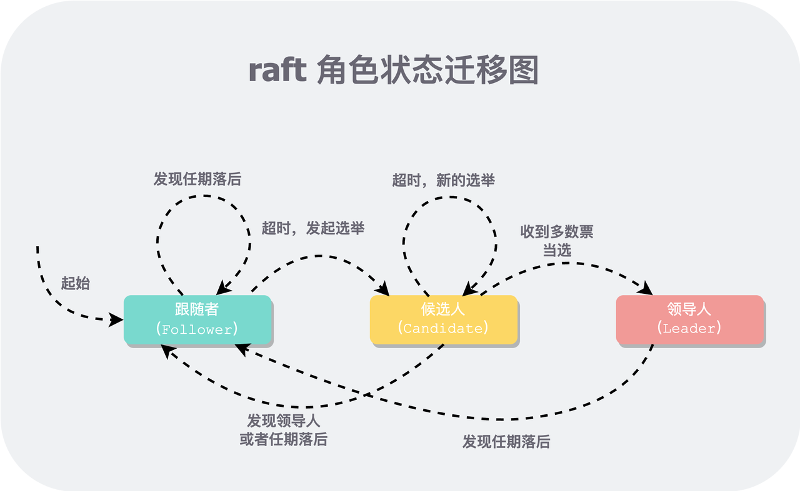

# 一句话:从节点向主节点收敛！

## 1.如何转化为主节点？
### 三种状态
Follower 从节点
Candidate 候选节点
Leader 主节点


4个最基本的转换
```C
F->C:超时，发起选举
C->L:收到多数票当选
L->F:任期落后
C->F:发现L或者任期落后
```

### 2.角色转换的巧记
所有的角色都遵循：
```C
0.触发条件？
1.能不能成？
2.能了干什么？
```
#### F:
##### 触发条件
```C
1.初始
2.F->F(来自L的压迫、宕机)
3.C->F(发现更高任期/L、宕机)
4.L->F(发现更高任期、宕机)
```
##### 能不能成？
Follower节点没有能不能成，一定成，只是触发条件！
##### 成了干什么？
一句话：向主节点收敛(三大件)
```C
1.三大件：
1.1 任期向主节点靠齐
1.2 重置投票

2.持久化：
如果任期改变的话，需要持久化！
```


---
#### C:
##### 触发条件？
```C
F 选举超时
```
##### 能不能成？
选举超时了一定成为Candidate，只不过在能不能成L的问题！
##### 成了干什么？
一句话：向主节点收敛(三大件)
```C
1.三大件：
1.1 重置选举时钟(本来就是时钟超时了成为的，那当然需要重置时钟)(期待下一次选举成为L)
1.2 任期+1
1.3 投自己一票

2.持久化：
一定会持久化！因为三大件至少有任期变化了！
```
---
#### L:
##### 触发条件？
```C
本身是C的前提下多数投票赞同
```
##### 能不能成？
```C
赞同的条件：
1.任期最高
2.日志最长
```

##### 成了干什么？
一句话：发送心跳使得其他节点向我收敛
```C
1.收敛前的准备工作：
1.1重置已匹配、待匹配下标：
commitIndex=0、nextIndex=log.size()

2.正式收敛
2.1心跳循环。后台线程等间隔的发送心跳/复制日志replicationTicker
2.2每次replicationTicker时，检测上下文，具体来说是检测自己还是不是当前的Leader，不是就立即退出loop
```