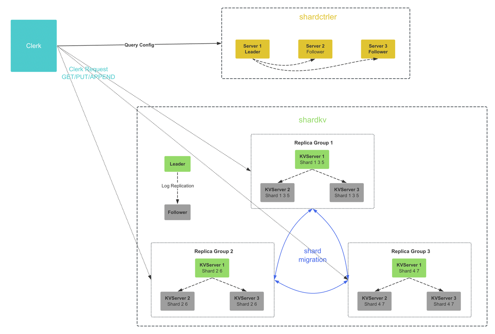

# 配置变更
配置变更的任务只修改 shard 状态，不进行实际的 shard 迁移操作

# 分片迁移
新增 shard 迁移的后台线程，定期执行 shard 的迁移

### 迁移时的数据竞态解决方案
**竞态数据本质**：本Group发送数据的同时又参与修改数据，导致多个Group数据不一致

**解决方案**：拷贝map数据

在不同的 Group 之间发送 shard 数据的时候，**一般不会持有 map 的锁**，例如数据发送到了另一个 Group，
但是当前 Group 又要修改这个 shard 的数据，那么就会产生竞态条件。一种解决方案是传输 map 结构的时候将其拷贝一份。

